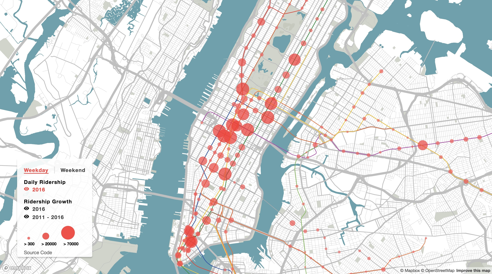

# [Subway Ridership Analysis](https://roxyi.github.io/subway_ridership/)



A platform for a detailed analysis on MTA subway ridership.

## Getting Started
Clone the repo
```
git clone https://github.com/Roxyi/subway_ridership.git
```

Install all dependencies
```
npm install
```

Run the app
```
Gulp
```

## Data
* [MTA Average Weekday Subway Ridership](http://web.mta.info/nyct/facts/ridership/ridership_sub.htm)
* [MTA Average Weekend (Saturday + Sunday) Subway Ridership](http://web.mta.info/nyct/facts/ridership/ridership_sub_weekend.htm)
* [MTA Subway Stops Locations](http://web.mta.info/developers/developer-data-terms.html#data)

## Built With

* [Mapbox GL JS](https://github.com/mapbox/mapbox-gl-js) - JavaScript Library for Web-Based Mapping
* [QGIS](https://www.qgis.org/en/site/) - Open Source Geographic Information System
